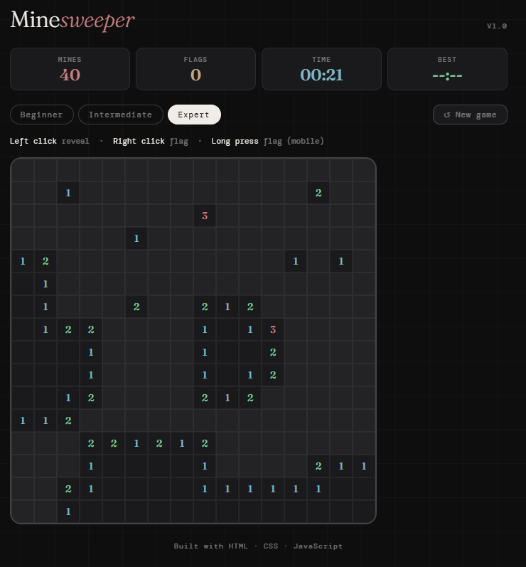

# 💣 Minesweeper

A fully-featured Minesweeper game built with vanilla HTML, CSS, and JavaScript. No frameworks, no dependencies.

[](https://nayanymous.github.io/minesweeper-js)
[](https://github.com/nayanymous/minesweeper-js)

***

## ✨ Features

| Feature | Details |
|---|---|
| 3 difficulty levels | Beginner (9×9, 10 mines), Intermediate (12×12, 25 mines), Expert (16×16, 40 mines) |
| First-click safety | Mines are placed after your first click, guaranteed safe start |
| Flood fill reveal | Clicking an empty cell auto-reveals all connected empty cells |
| Flag system | Right-click or long-press to flag suspected mines |
| Mine counter | Tracks total mines remaining |
| Flag counter | Tracks how many flags you've placed |
| Live timer | Tracks your solve time per game |
| Best time tracking | Saved per difficulty in localStorage |
| Mobile support | Long press to flag on touch devices |
| Win & lose overlays | Clear feedback with time and stats |
| Zero dependencies | Pure HTML, CSS, JavaScript |

***

## 🚀 Live Demo

👉 [Play it here](https://nayanymous.github.io/minesweeper-js)

***

## 📸 Screenshot



***

## 🕹️ Controls

| Action | Desktop | Mobile |
|---|---|---|
| Reveal cell | Left click | Tap |
| Flag cell | Right click | Long press |
| New game | New game button | New game button |

***

## 🎯 Difficulty Levels

| Level | Grid | Mines |
|---|---|---|
| Beginner | 9 × 9 | 10 |
| Intermediate | 12 × 12 | 25 |
| Expert | 16 × 16 | 40 |

***

## 🛠️ Tech Stack

| Technology | Usage |
|---|---|
| HTML5 | Game structure & semantics |
| CSS3 | Styling, grid layout, dark theme |
| Vanilla JavaScript | Game logic, algorithms, state |
| localStorage | Best time persistence per difficulty |

***

## 🧠 How It Works

### First-click safety
Mines are not placed until after the player's first click. A safe zone (3×3 area around first click) is excluded from mine placement, guaranteeing a clean start.

### Flood fill algorithm
When a cell with 0 adjacent mines is revealed, the game uses a **recursive flood fill** to automatically reveal all connected empty cells and their numbered neighbors — the same algorithm used in paint bucket tools and graph traversal.

### Mine placement
After the first click, mines are placed using random sampling with the safe zone excluded. Adjacent mine counts are calculated for every non-mine cell.

***

## 📂 Project Structure

```
minesweeper-js/
├── index.html       ← entire game in one file
├── README.md        ← this file
└── screenshot.png   ← gameplay screenshot
```

***

## ▶️ Run Locally

```bash
git clone https://github.com/nayanymous/minesweeper-js.git
cd minesweeper-js
open index.html
```

***

## 🌐 Deploy to GitHub Pages

1. Push this repo to GitHub
2. Go to **Settings → Pages**
3. Set source to `main` branch, `/ (root)`
4. Live at `https://nayanymous.github.io/minesweeper-js`

***

## 📌 What I Learned

| Topic | Details |
|---|---|
| Flood fill algorithm | Recursive graph traversal for auto-reveal |
| First-click safety | Deferred mine placement logic |
| Dynamic grid rendering | CSS Grid with variable columns |
| Touch events | Long press detection for mobile flagging |
| localStorage | Per-difficulty best time tracking |

***

## 📬 Connect

Made by **Md. Rakibul Islam Nayan** · [LinkedIn](https://www.linkedin.com/in/rakibul-islam-nayan/) · [GitHub](https://github.com/nayanymous)

> If you like it, please ⭐ star the repo. It means a lot!
